NFDI4Earth
================
Josepha Schiller
2025-07-30

- [Project: NFDI4Earth Hackathon
  11.2025](#project-nfdi4earth-hackathon-112025)
  - [Goal: Explore data and run example machine learning
    analysis](#goal-explore-data-and-run-example-machine-learning-analysis)
  - [1. Load libraries](#1-load-libraries)
- [2. Load data](#2-load-data)
- [3. Data exploration](#3-data-exploration)
  - [3.1 Describe the dataset](#31-describe-the-dataset)
    - [How is the data quality?](#how-is-the-data-quality)
    - [Visual eploration](#visual-eploration)
  - [3.2 Introspection](#32-introspection)
- [4. Data analysis](#4-data-analysis)
  - [4.1 Test and training data](#41-test-and-training-data)
  - [4.2 Choose cross-validation](#42-choose-cross-validation)
  - [4.3 Fit the models](#43-fit-the-models)
  - [4.4 Test the model performance](#44-test-the-model-performance)
  - [5 Interpretable machine
    learning](#5-interpretable-machine-learning)
    - [5.1 Variable importance](#51-variable-importance)
    - [5.1 Variable associations](#51-variable-associations)
    - [5.3 Variable interactions](#53-variable-interactions)
  - [6 Further literature on learning machine
    learning](#6-further-literature-on-learning-machine-learning)

# Project: NFDI4Earth Hackathon 11.2025

## Goal: Explore data and run example machine learning analysis

**Author:** Josepha Schiller  
**Date:** 30.07.2025  
**Last update:** 04.11.2025

> **Provenance**  
> This code adapts Ryo (2022)
> (<https://github.com/masahiroryo/2022_IML_Agriculture/tree/main>).  
> **Disclaimer:** A GPT-5 agent was used to improve explanations and
> comments. All AI-assisted edits were reviewed and verified by the
> author.

------------------------------------------------------------------------

## 1. Load libraries

Throughout this script we will rely on a number of packages from the R
ecosystem. These packages provide helper functions for data
manipulation, plotting, and machine learning. Below we **load** them at
once so they are available later. You do **not** need to understand
every package now; inline comments clarify each library’s role.

``` r
library(tidyverse)  # core collection of packages for data manipulation and visualisation
library(stringr)    # string processing functions used throughout the tidyverse
library(readr)      # efficient functions for reading flat files such as csv
library(patchwork)  # combine multiple ggplot2 objects into one layout
library(reshape2)   # additional tools for reshaping data (e.g. melt, dcast)
library(rlang)      # tidy evaluation tools; enables !!sym() in ggplot expressions
library(corrplot)   # functions to visualise correlation matrices
library(car)        # `car` contains the `vif()` function for multicollinearity diagnostics

# Machine Learning specific libraries
library(caret)      # wrapper for training and comparing many machine learning models
library(pdp)        # create partial dependence plots for model interpretation
library(vip)        # variable importance plots (including permutation importance)
library(iml)        # general interpretable machine‑learning tools (not used directly here)
```

After loading the libraries, it can be helpful to print the current R
session information. The `sessionInfo()` function returns details about
your R version, operating system and loaded packages; this improves
**reproducibility** when you share your analysis with others.

``` r
sessionInfo()  # display versions of R and the loaded packages
```

    ## R version 4.3.2 (2023-10-31 ucrt)
    ## Platform: x86_64-w64-mingw32/x64 (64-bit)
    ## Running under: Windows 11 x64 (build 26100)
    ## 
    ## Matrix products: default
    ## 
    ## 
    ## locale:
    ## [1] LC_COLLATE=English_United Kingdom.utf8 
    ## [2] LC_CTYPE=English_United Kingdom.utf8   
    ## [3] LC_MONETARY=English_United Kingdom.utf8
    ## [4] LC_NUMERIC=C                           
    ## [5] LC_TIME=English_United Kingdom.utf8    
    ## 
    ## time zone: Europe/Berlin
    ## tzcode source: internal
    ## 
    ## attached base packages:
    ## [1] stats     graphics  grDevices utils     datasets  methods   base     
    ## 
    ## other attached packages:
    ##  [1] iml_0.11.3      vip_0.4.1       pdp_0.8.1       caret_6.0-94   
    ##  [5] lattice_0.21-9  car_3.1-2       carData_3.0-5   corrplot_0.92  
    ##  [9] rlang_1.1.3     reshape2_1.4.4  patchwork_1.2.0 lubridate_1.9.3
    ## [13] forcats_1.0.0   stringr_1.5.1   dplyr_1.1.4     purrr_1.0.2    
    ## [17] readr_2.1.5     tidyr_1.3.1     tibble_3.2.1    ggplot2_3.5.1  
    ## [21] tidyverse_2.0.0
    ## 
    ## loaded via a namespace (and not attached):
    ##  [1] tidyselect_1.2.1     timeDate_4032.109    fastmap_1.1.1       
    ##  [4] pROC_1.18.5          digest_0.6.35        rpart_4.1.21        
    ##  [7] timechange_0.3.0     lifecycle_1.0.4      survival_3.5-7      
    ## [10] magrittr_2.0.3       compiler_4.3.2       tools_4.3.2         
    ## [13] utf8_1.2.4           yaml_2.3.8           data.table_1.15.4   
    ## [16] knitr_1.46           plyr_1.8.9           abind_1.4-5         
    ## [19] withr_3.0.0          Metrics_0.1.4        nnet_7.3-19         
    ## [22] grid_4.3.2           stats4_4.3.2         fansi_1.0.6         
    ## [25] colorspace_2.1-0     future_1.33.2        globals_0.16.3      
    ## [28] scales_1.3.0         iterators_1.0.14     MASS_7.3-60         
    ## [31] cli_3.6.2            rmarkdown_2.26       generics_0.1.3      
    ## [34] rstudioapi_0.16.0    future.apply_1.11.2  tzdb_0.4.0          
    ## [37] splines_4.3.2        parallel_4.3.2       vctrs_0.6.5         
    ## [40] hardhat_1.3.1        Matrix_1.6-1.1       hms_1.1.3           
    ## [43] listenv_0.9.1        foreach_1.5.2        gower_1.0.1         
    ## [46] recipes_1.0.10       glue_1.7.0           parallelly_1.37.1   
    ## [49] codetools_0.2-19     stringi_1.8.3        gtable_0.3.5        
    ## [52] munsell_0.5.1        pillar_1.9.0         htmltools_0.5.8.1   
    ## [55] ipred_0.9-14         lava_1.8.0           R6_2.5.1            
    ## [58] evaluate_0.23        backports_1.4.1      class_7.3-22        
    ## [61] Rcpp_1.0.12          nlme_3.1-163         prodlim_2023.08.28  
    ## [64] checkmate_2.3.1      xfun_0.43            pkgconfig_2.0.3     
    ## [67] ModelMetrics_1.2.2.2

# 2. Load data

In this section we read the dataset. The **Air Quality Index (AQI)**
dataset is stored as a comma‑separated values (CSV) file. You will need
to adapt the path in `setwd()` to point to the directory where your copy
of the dataset resides.

``` r
setwd("D:/Josi/PhD/Events/Kurse/2025_NFDI4Earth/2025_ML-Intro_Kurs/Hackathon_planning/aqi_data_kaggle") # set the working directory so R knows where to look for the data; change this to your own path
list.files()                                                      # inspect the files in the directory to confirm the dataset is present
```

    ## [1] "aqi_dataset.csv"          "aqi_dataset_positive.csv"
    ## [3] "Readme.txt"

``` r
dta = read.table(file = "aqi_dataset_positive.csv", header = TRUE, sep = ",") # read the CSV file into a data frame called dta
```

When reading in data, always check that the file loaded correctly and
that the separator (`sep`) matches the file format. Using
`header = TRUE` tells R to use the first row of the CSV file as column
names.

# 3. Data exploration

We start with the exploratory data analysis (EDA) following the DIG
framework.  
This includes getting an idea about what data is included in our
dataset.

1.  Describe the dataset
2.  Introspection: brainstorm research questions
3.  Goal setting: define a research question

## 3.1 Describe the dataset

What are the column variable names?

``` r
colnames(dta)  # returns a vector with all column names in the data frame
```

    ## [1] "temperature"         "humidity"            "wind_speed"         
    ## [4] "traffic_density"     "industrial_activity" "AQI"

Show one sample value from each column.

``` r
dta %>%
  summarise(across(everything(), ~ .x[!is.na(.x)][1]))  # for each column, pick the first non‑missing observation
```

    ##   temperature humidity wind_speed traffic_density industrial_activity    AQI
    ## 1       28.48    70.89       7.49              10               83.67 149.46

We can also look at the top rows.

``` r
dta %>% head()  # display the first six rows to get a sense of the data
```

    ##   temperature humidity wind_speed traffic_density industrial_activity    AQI
    ## 1       28.48    70.89       7.49              10               83.67 149.46
    ## 2       24.03    65.24      14.13               9               49.93 164.90
    ## 3       29.53    55.93      15.29               7               82.52 155.39
    ## 4       35.66    74.91       9.91               3               31.72 105.21
    ## 5       23.36    60.99       8.38               3               45.26 118.21
    ## 6       23.36    53.03      14.88               5               37.80  66.10

We can look at the data structure.

``` r
dta %>% str()  # show the structure: column names, types and preview of values
```

    ## 'data.frame':    14235 obs. of  6 variables:
    ##  $ temperature        : num  28.5 24 29.5 35.7 23.4 ...
    ##  $ humidity           : num  70.9 65.2 55.9 74.9 61 ...
    ##  $ wind_speed         : num  7.49 14.13 15.29 9.91 8.38 ...
    ##  $ traffic_density    : int  10 9 7 3 3 5 7 7 NA 1 ...
    ##  $ industrial_activity: num  83.7 49.9 82.5 31.7 45.3 ...
    ##  $ AQI                : num  149 165 155 105 118 ...

### How is the data quality?

Missing values per column:

``` r
colSums(is.na(dta)) # count the number of missing (NA) values in each column
```

    ##         temperature            humidity          wind_speed     traffic_density 
    ##                 283                 284                 280                 142 
    ## industrial_activity                 AQI 
    ##                 142                   0

``` r
# or

dta %>%
  summarise(across(everything(), ~ sum(is.na(.x) | .x == ""), .names = "missing_{.col}"))  # another way to count missing or empty values per column
```

    ##   missing_temperature missing_humidity missing_wind_speed
    ## 1                 283              284                280
    ##   missing_traffic_density missing_industrial_activity missing_AQI
    ## 1                     142                         142           0

Data types for each column

``` r
sapply(dta, class)  # returns the class (e.g., numeric, factor) of each column
```

    ##         temperature            humidity          wind_speed     traffic_density 
    ##           "numeric"           "numeric"           "numeric"           "integer" 
    ## industrial_activity                 AQI 
    ##           "numeric"           "numeric"

We can also look at the summary statistics for this dataset. What to
look for? Missing values, realistic ranges in variables.

``` r
summary(dta)  # provides min, median, mean and max for numeric columns
```

    ##   temperature       humidity        wind_speed     traffic_density 
    ##  Min.   : 0.00   Min.   :  2.15   Min.   : 0.000   Min.   : 1.000  
    ##  1st Qu.:20.33   1st Qu.: 49.80   1st Qu.: 7.930   1st Qu.: 3.000  
    ##  Median :25.00   Median : 60.12   Median : 9.990   Median : 6.000  
    ##  Mean   :25.01   Mean   : 60.05   Mean   : 9.995   Mean   : 5.566  
    ##  3rd Qu.:29.71   3rd Qu.: 70.17   3rd Qu.:12.060   3rd Qu.: 8.000  
    ##  Max.   :52.48   Max.   :127.19   Max.   :21.180   Max.   :10.000  
    ##  NA's   :283     NA's   :284      NA's   :280      NA's   :142     
    ##  industrial_activity      AQI        
    ##  Min.   :  0.00      Min.   :  0.00  
    ##  1st Qu.: 36.55      1st Qu.: 82.92  
    ##  Median : 50.44      Median :121.33  
    ##  Mean   : 50.28      Mean   :122.23  
    ##  3rd Qu.: 64.02      3rd Qu.:159.29  
    ##  Max.   :124.91      Max.   :531.03  
    ##  NA's   :142

How much percent of the data are missing?

``` r
# Count total rows
n <- nrow(dta)                            # total number of rows in the dataset

col_missing <- colSums(is.na(dta))        # number of missing values per column

col_missing_pct <- (col_missing / n) * 100 # compute missing values as percentage of total rows

col_missing_pct                           # print the percentages for each column
```

    ##         temperature            humidity          wind_speed     traffic_density 
    ##           1.9880576           1.9950825           1.9669828           0.9975413 
    ## industrial_activity                 AQI 
    ##           0.9975413           0.0000000

It is important to keep in mind that for the machine learning analysis,
we cannot use data rows that have NA values. That’s why we can check how
many rows remain after removing NA values.

``` r
dta %>% na.omit()  %>% head() # remove any rows containing at least one missing value
```

    ##   temperature humidity wind_speed traffic_density industrial_activity    AQI
    ## 1       28.48    70.89       7.49              10               83.67 149.46
    ## 2       24.03    65.24      14.13               9               49.93 164.90
    ## 3       29.53    55.93      15.29               7               82.52 155.39
    ## 4       35.66    74.91       9.91               3               31.72 105.21
    ## 5       23.36    60.99       8.38               3               45.26 118.21
    ## 6       23.36    53.03      14.88               5               37.80  66.10

Check for duplicates.

``` r
# Check for duplicated rows
sum(duplicated(dta))              # returns the count of exact duplicate rows
```

    ## [1] 0

``` r
# View duplicated rows (if any)
dta[duplicated(dta), ]            # print rows that are duplicates for inspection
```

    ## [1] temperature         humidity            wind_speed         
    ## [4] traffic_density     industrial_activity AQI                
    ## <0 rows> (or 0-length row.names)

### Visual eploration

Histograms allow to see the range, distribution, and outliers.

``` r
df <- dta

for (col in names(df)) {
  if (is.numeric(df[[col]])) {                                         # only produce histograms for numeric variables
    p <- ggplot(df, aes(x = !!sym(col))) +                             # dynamically map the column name using !!sym() from rlang
      geom_histogram(bins = 30, fill = "steelblue", color = "black") + # 30 bins provides a reasonable balance of detail
      labs(title = paste("Histogram of", col), x = col, y = "Frequency")
    print(p)                                                           # print each histogram within the loop
  }
}
```

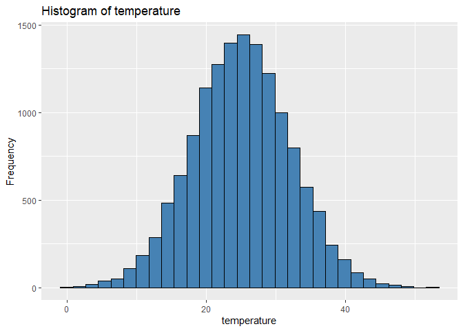<!-- -->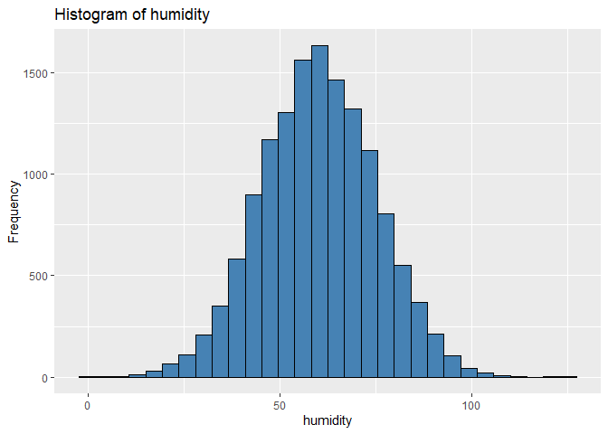<!-- -->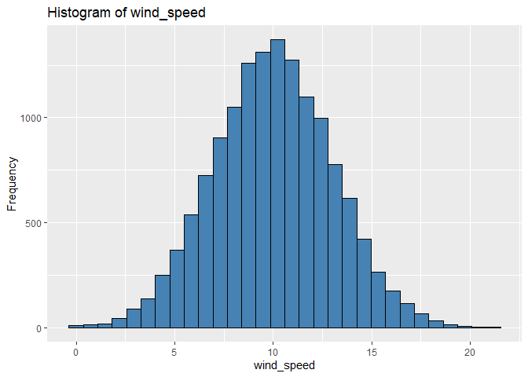<!-- -->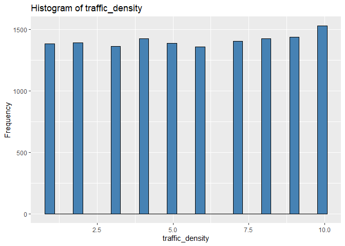<!-- -->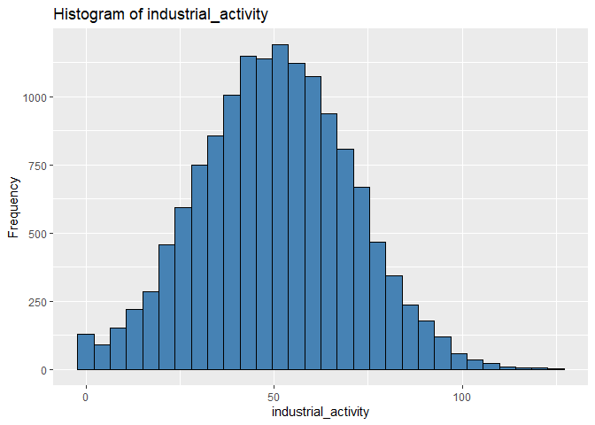<!-- -->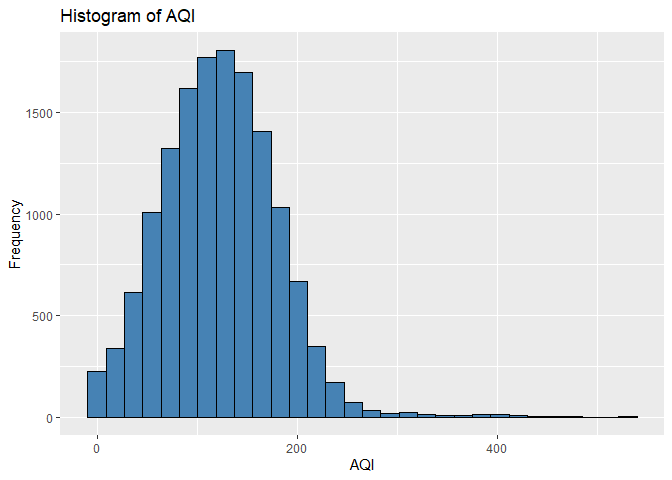<!-- -->

Box plots are nice because they give information about: Min, Q1, Median,
Q3, Max. Outliers can be recognized beyond the whiskers.

``` r
# Long format of numeric columns

df_long <- df %>%
  dplyr::select(where(is.numeric)) %>%
  pivot_longer(everything(), names_to = "variable", values_to = "value")  # reshape into two columns: variable and value

ggplot(df_long, aes(x = variable, y = value)) +
  geom_boxplot(fill = "orange", color = "black", alpha = 0.7) +         # boxplots summarise distribution for each variable
  labs(title = "Boxplots per Variable", x = NULL, y = NULL) +
  theme_minimal()
```

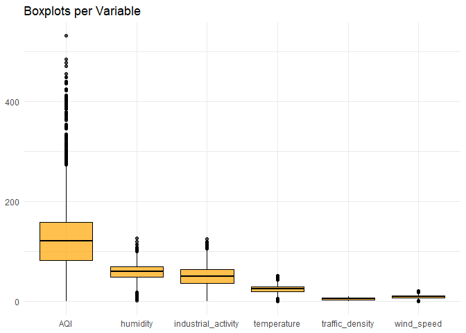<!-- -->

A very nice way to combine information from boxplots and histograms are
violinplots.

``` r
ggplot(df_long, aes(x = variable, y = value)) +
  geom_violin(fill = "orange", alpha = 0.35, trim = FALSE) +                        # violin plots combine density estimation and range
  geom_jitter(width = 0.15, alpha = 0.35, size = 1, color = "steelblue") +          # jittered points show individual observations
  stat_summary(fun = mean, geom = "point", shape = 23, size = 2.5, fill = "red") +  # add a red diamond to denote the mean
  labs(title = "Violin + Jitter + Mean per Variable",
       x = NULL, y = NULL) +
  theme_minimal() +
  facet_wrap(~ variable, scales = "free")                                           # facet each variable to its own panel
```

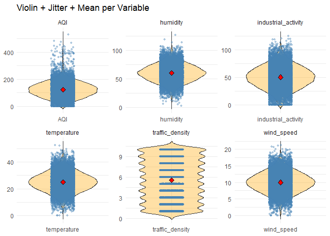<!-- -->

## 3.2 Introspection

**What research questions could possibly be answered?**

After exploring the dataset and understanding its structure, the next
step is to formulate potential research questions. The research question
guides the direction of the analysis and help determine which variables
are most relevant.

When defining the research question, one must ensure that the variables
used for prediction are complete (no missing values). Why? Machine
learning models cannot handle missing values directly. Variables with a
large proportion of missing data are not suitable for use as predictors
unless imputation or other strategies are applied.

**Example research question:** Predicting air quality Index based on the
given variables

Now that we have a research question in mind, we can do more directed
data exploration. Bivariate scatter plots with target variable “AQI”
allow to detect links between target and predictor variables.

``` r
# Put data in long format: predictors + AQI

df_long <- df %>%
  select(where(is.numeric)) %>%
  pivot_longer(cols = -AQI, names_to = "variable", values_to = "value")   # convert wide data to long form excluding AQI

# Scatter plots with regression lines, faceted by variable

ggplot(df_long, aes(x = value, y = AQI)) +
  geom_point(alpha = 0.3, size = 1, color = "steelblue") +                # scatter plot of predictor vs AQI
  geom_smooth(method = "lm", se = FALSE, color = "red") +                 # add linear regression line without confidence band
  facet_wrap(~ variable, scales = "free_x", ncol = 3) +                   # separate plot for each predictor
  labs(title = "Scatter plots: AQI vs predictors",
       x = "Predictor value", y = "AQI") +
  theme_minimal()
```

    ## `geom_smooth()` using formula = 'y ~ x'

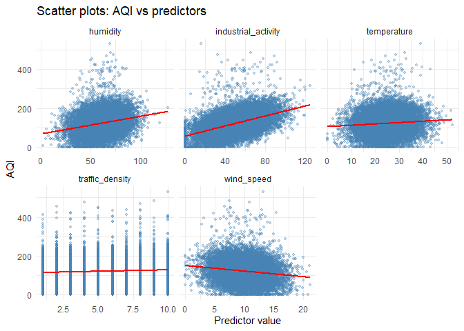<!-- -->

Use correlation matrix to test linear relationship between variables.

``` r
RQ1 <- df %>% na.omit()           # remove rows containing missing values before computing correlations
cor_matrix <- cor(RQ1)            # calculate the Pearson correlation matrix for all numeric variables
print(cor_matrix)                 # print the resulting correlation coefficients
```

    ##                      temperature     humidity    wind_speed traffic_density
    ## temperature          1.000000000 -0.005799924 -0.0016146940    0.0035004215
    ## humidity            -0.005799924  1.000000000  0.0043504349    0.0041360852
    ## wind_speed          -0.001614694  0.004350435  1.0000000000    0.0005046893
    ## traffic_density      0.003500421  0.004136085  0.0005046893    1.0000000000
    ## industrial_activity  0.002203901  0.004123744 -0.0050507687    0.0051472071
    ## AQI                  0.082760621  0.238186005 -0.1545413607    0.0743398761
    ##                     industrial_activity         AQI
    ## temperature                 0.002203901  0.08276062
    ## humidity                    0.004123744  0.23818600
    ## wind_speed                 -0.005050769 -0.15454136
    ## traffic_density             0.005147207  0.07433988
    ## industrial_activity         1.000000000  0.45343373
    ## AQI                         0.453433726  1.00000000

Draw a heatmap. Variables with correlation coefficients higher abs(0.7)
can be considered es multi-collinear.

``` r
corrplot(cor_matrix, method = "color", 
         addCoef.col = "black",   # overlay the numeric correlation values on the heatmap
         tl.col = "black",        # text colour for variable labels
         tl.cex = 0.8,            # scale label size
         number.cex = 0.7)        # scale the printed correlation coefficients
```

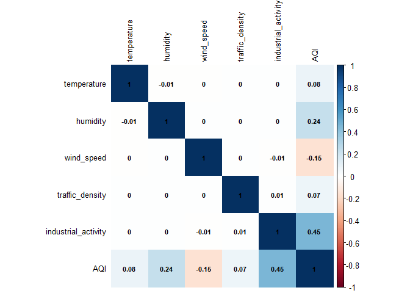<!-- -->

We can also check for variable inflation factor (VIF) to better detect
multi-collinearity.

``` r
# Fit a linear model with AQI as outcome and all predictors
model <- lm(AQI ~ temperature + humidity + wind_speed + traffic_density + industrial_activity, data = df)

# Compute VIF
vif_values <- vif(model)  # variance inflation factor for each predictor
print(vif_values)         # VIF values > 5–10 may indicate problematic multi-collinearity
```

    ##         temperature            humidity          wind_speed     traffic_density 
    ##            1.000053            1.000087            1.000047            1.000056 
    ## industrial_activity 
    ##            1.000074

Based on correlation and VIF, we don’t expect multi-collinearity.

# 4. Data analysis

**Task:** Regression

## 4.1 Test and training data

Common splits are 80/20 or 70/30 splits. Training data are used to fit a
model. Testing data are then used to test the model’s performance.

``` r
set.seed(1)                                                               # set seed to make the sampling reproducible
train_test_split <- sample(1:nrow(RQ1), 0.8 * nrow(RQ1), replace = FALSE) # randomly select 80% of row indices for training
data_train <- RQ1[train_test_split, ]                                     # training set
data_test  <- RQ1[-train_test_split, ]                                    # hold‑out test set comprising the remaining rows
```

## 4.2 Choose cross-validation

Cross-validation (CV) is a resampling method used to validate a fitted
model during the training phase. It is also used to select
hyperparameters to get the best performance.

``` r
tc = trainControl(method = "cv" , number = 5)  # define a 5‑fold cross‑validation strategy for model training
```

In 5-fold CV the training dataset is split into k=5 subsets (typically k
= 5-10). Each fold is used once as validation data, while the remaining
k-1 are used as training data to fit a model. By choosing CV the full
model training process becomes more robust.

When combined with a training controller (e.g., trainControl in R’s
caret package), multiple hyperparameter values are tested automatically,
and the best-performing set is selected based on cross-validation
results. This removes the need for manual hyperparameter tuning.

## 4.3 Fit the models

Caret is a wrapper package that supports many different machine learning
models. This makes comparison of different models easy. It is important
to set a seed before fitting the model to ensure reproducibility.

**Fit a linear regression model:** This model uses organic matter as the
response (target) variable and the remaining variables as the predictor
variables. A formula can be set manually, too, to select only particular
variables.

``` r
set.seed(123)   # fix the random number seed to make model training reproducible
model.lm   = caret::train(AQI ~ ., data=data_train, method="glmStepAIC", trControl=tc) # train a linear regression model with stepwise selection
```

    ## Start:  AIC=88816.04
    ## .outcome ~ temperature + humidity + wind_speed + traffic_density + 
    ##     industrial_activity
    ## 
    ##                       Df Deviance   AIC
    ## <none>                   18970603 88816
    ## - traffic_density      1 19090471 88867
    ## - temperature          1 19159168 88897
    ## - wind_speed           1 19693339 89128
    ## - humidity             1 20499491 89466
    ## - industrial_activity  1 24594560 90998
    ## Start:  AIC=88862.85
    ## .outcome ~ temperature + humidity + wind_speed + traffic_density + 
    ##     industrial_activity
    ## 
    ##                       Df Deviance   AIC
    ## <none>                   19098202 88863
    ## - traffic_density      1 19239050 88923
    ## - temperature          1 19269466 88936
    ## - wind_speed           1 19766050 89150
    ## - humidity             1 20524001 89466
    ## - industrial_activity  1 24953288 91110
    ## Start:  AIC=88794.98
    ## .outcome ~ temperature + humidity + wind_speed + traffic_density + 
    ##     industrial_activity
    ## 
    ##                       Df Deviance   AIC
    ## <none>                   18966226 88795
    ## - traffic_density      1 19148684 88873
    ## - temperature          1 19162343 88879
    ## - wind_speed           1 19635082 89084
    ## - humidity             1 20487206 89442
    ## - industrial_activity  1 24805378 91050
    ## Start:  AIC=88893.55
    ## .outcome ~ temperature + humidity + wind_speed + traffic_density + 
    ##     industrial_activity
    ## 
    ##                       Df Deviance   AIC
    ## <none>                   19168037 88894
    ## - traffic_density      1 19298244 88948
    ## - temperature          1 19369088 88979
    ## - wind_speed           1 19790783 89160
    ## - humidity             1 20618510 89505
    ## - industrial_activity  1 24707827 91026
    ## Start:  AIC=88546.58
    ## .outcome ~ temperature + humidity + wind_speed + traffic_density + 
    ##     industrial_activity
    ## 
    ##                       Df Deviance   AIC
    ## <none>                   18414087 88547
    ## - traffic_density      1 18566764 88614
    ## - temperature          1 18602019 88630
    ## - wind_speed           1 19024114 88819
    ## - humidity             1 19880237 89189
    ## - industrial_activity  1 24174982 90833
    ## Start:  AIC=110977.4
    ## .outcome ~ temperature + humidity + wind_speed + traffic_density + 
    ##     industrial_activity
    ## 
    ##                       Df Deviance    AIC
    ## <none>                   23657417 110977
    ## - traffic_density      1 23837846 111055
    ## - temperature          1 23893264 111080
    ## - wind_speed           1 24479373 111334
    ## - humidity             1 25505474 111766
    ## - industrial_activity  1 30813142 113753

Print the fitted linear model summary

``` r
model.lm        
```

    ## Generalized Linear Model with Stepwise Feature Selection 
    ## 
    ## 10511 samples
    ##     5 predictor
    ## 
    ## No pre-processing
    ## Resampling: Cross-Validated (5 fold) 
    ## Summary of sample sizes: 8410, 8409, 8408, 8409, 8408 
    ## Resampling results:
    ## 
    ##   RMSE      Rsquared  MAE     
    ##   47.45184  0.302339  37.74735

**Fit a decision tree model:** decision trees use an if-else structure
to make predictions. The model can tend to overfitting.

``` r
set.seed(123)
model.cart = caret::train(AQI ~ ., data=data_train, method="ctree", trControl=tc) # conditional inference tree from the partykit package
```

Print the model summary

``` r
model.cart
```

    ## Conditional Inference Tree 
    ## 
    ## 10511 samples
    ##     5 predictor
    ## 
    ## No pre-processing
    ## Resampling: Cross-Validated (5 fold) 
    ## Summary of sample sizes: 8410, 8409, 8408, 8409, 8408 
    ## Resampling results across tuning parameters:
    ## 
    ##   mincriterion  RMSE      Rsquared   MAE     
    ##   0.01          53.59859  0.1840521  42.30860
    ##   0.50          49.98158  0.2384056  39.63938
    ##   0.99          49.42259  0.2447451  39.27189
    ## 
    ## RMSE was used to select the optimal model using the smallest value.
    ## The final value used for the model was mincriterion = 0.99.

**Fit a random forest model:** makes use of several decision trees and
averages the predictions among multiple trees. Typically, using a model
that combines several trees ((ensemble models) makes more robust and
better predictions than a single tree. Computation takes some minutes.

``` r
set.seed(123)
model.rf   = caret::train(AQI ~ ., data=data_train, method="rf", trControl=tc) # random forest: ensemble of decision trees
```

Print the model summary

``` r
model.rf
```

    ## Random Forest 
    ## 
    ## 10511 samples
    ##     5 predictor
    ## 
    ## No pre-processing
    ## Resampling: Cross-Validated (5 fold) 
    ## Summary of sample sizes: 8410, 8409, 8408, 8409, 8408 
    ## Resampling results across tuning parameters:
    ## 
    ##   mtry  RMSE      Rsquared   MAE     
    ##   2     48.46981  0.2730040  38.48039
    ##   3     48.69378  0.2678846  38.61463
    ##   5     48.88798  0.2635210  38.74804
    ## 
    ## RMSE was used to select the optimal model using the smallest value.
    ## The final value used for the model was mtry = 2.

**Fit a gradient boosting model:** this model also uses several trees.
However, it starts with a single tree and improves this tree’s
performance several times by reducing its error rate sequentially.
Computation takes some minutes.

``` r
set.seed(123)
model.gbm  = caret::train(AQI ~ ., data=data_train, method="gbm", trControl=tc,
                          tuneGrid = expand.grid(n.trees = (1:5)*500,        # number of boosting iterations
                                                 interaction.depth = (1:5)*3, # maximum depth of each tree
                                                 shrinkage = 0.1,            # learning rate controlling contribution of each tree
                                                 n.minobsinnode = 10))       # minimum number of observations per terminal node
```

Print the model summary

``` r
model.gbm
```

    ## Stochastic Gradient Boosting 
    ## 
    ## 10511 samples
    ##     5 predictor
    ## 
    ## No pre-processing
    ## Resampling: Cross-Validated (5 fold) 
    ## Summary of sample sizes: 8410, 8409, 8408, 8409, 8408 
    ## Resampling results across tuning parameters:
    ## 
    ##   interaction.depth  n.trees  RMSE      Rsquared   MAE     
    ##    3                  500     48.13231  0.2832771  38.22553
    ##    3                 1000     48.65456  0.2702587  38.63630
    ##    3                 1500     49.09269  0.2598488  38.93197
    ##    3                 2000     49.44151  0.2526937  39.19839
    ##    3                 2500     49.83296  0.2437837  39.49618
    ##    6                  500     48.78345  0.2670270  38.69556
    ##    6                 1000     49.78810  0.2449805  39.37287
    ##    6                 1500     50.57890  0.2298610  39.94142
    ##    6                 2000     51.22206  0.2190822  40.40964
    ##    6                 2500     51.73292  0.2111023  40.80486
    ##    9                  500     49.29898  0.2555439  39.08343
    ##    9                 1000     50.45588  0.2331222  39.95643
    ##    9                 1500     51.40652  0.2174756  40.62794
    ##    9                 2000     52.17420  0.2057388  41.21660
    ##    9                 2500     52.70148  0.1984304  41.67649
    ##   12                  500     49.72353  0.2469666  39.35181
    ##   12                 1000     51.09148  0.2228418  40.31961
    ##   12                 1500     52.14511  0.2065028  41.15276
    ##   12                 2000     52.88642  0.1968173  41.71359
    ##   12                 2500     53.58155  0.1877185  42.23412
    ##   15                  500     50.35967  0.2328071  39.78353
    ##   15                 1000     51.94954  0.2062736  40.97851
    ##   15                 1500     52.94702  0.1926094  41.70968
    ##   15                 2000     53.80128  0.1816460  42.36877
    ##   15                 2500     54.37688  0.1748253  42.86635
    ## 
    ## Tuning parameter 'shrinkage' was held constant at a value of 0.1
    ## 
    ## Tuning parameter 'n.minobsinnode' was held constant at a value of 10
    ## RMSE was used to select the optimal model using the smallest value.
    ## The final values used for the model were n.trees = 500, interaction.depth =
    ##  3, shrinkage = 0.1 and n.minobsinnode = 10.

Now, we are done training the models. In the next step, we test the
model performance using the test dataset

## 4.4 Test the model performance

In this step, we make use of the fitted models to make predictions with
the test dataset.

``` r
pred.lm   <- predict(model.lm, data_test)   # generate predictions from the linear model on the test set
pred.cart <- predict(model.cart, data_test) # predictions from decision tree
pred.rf   <- predict(model.rf, data_test)   # predictions from random forest
pred.gbm  <- predict(model.gbm, data_test)  # predictions from gradient boosting machine
```

We compare the relationship between the observations and the predictions
of the test data. One popular measure is the R-squared value. It
explains the proportion of variance in the response variable that is
explained by using the predictor variables.

One easy way to compute this measure is to use the squared correlation
coefficient.

``` r
# r2: obs vs pred
r2.lm   <- cor(pred.lm, data_test$AQI)^2 %>% round(.,4)    # square of Pearson correlation for linear model
r2.cart <- cor(pred.cart, data_test$AQI)^2 %>% round(.,4) # R^2 for decision tree
r2.rf   <- cor(pred.rf, data_test$AQI)^2 %>% round(.,4)    # R^2 for random forest
r2.gbm  <- cor(pred.gbm, data_test$AQI)^2 %>% round(.,4)   # R^2 for gradient boosting
```

We can compare the performance of the different models by showing a
table with r-squared values or we can also show it visually.

``` r
r2 <- data.frame(r2 = c(r2.lm, r2.cart, r2.rf, r2.gbm),
                 algorithm = c("Linear model", "Decision Tree", "Random Forests", "Gradient Boosting") %>%
                             factor(., levels = c("Linear model", "Decision Tree", "Random Forests", "Gradient Boosting")))

r2
```

    ##       r2         algorithm
    ## 1 0.2748      Linear model
    ## 2 0.2281     Decision Tree
    ## 3 0.2433    Random Forests
    ## 4 0.2639 Gradient Boosting

``` r
Fig02 <-
ggplot(r2, aes(x = algorithm, y = r2, fill = algorithm)) + 
  geom_bar(stat = "identity") +                              # bar height represents R^2 for each model
  ylab("R-squared") +
  scale_fill_manual(values = c("Linear model"   = "grey",
                               "Decision Tree"  = "orange",
                               "Random Forests" = "darkgreen",
                               "Gradient Boosting" = "darkblue")) +
  theme_bw() +
  theme(legend.position = "none")                           # hide redundant legend
```

``` r
Fig02  # display bar chart comparing model performances
```

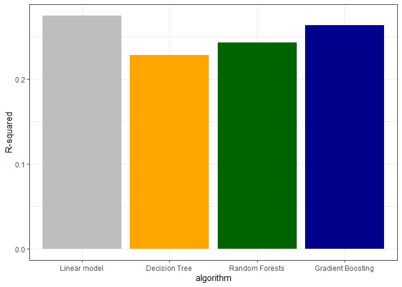<!-- -->

Now we are done with testing the model performance, however we have no
idea about how the fitted model actually looks like. E.g., what
variables are important and in what relationship is a predictive
variable with the response variable. Furthermore, we might have some
errors in our models because of a wrong data preparation or variable
use.

To get information about the models, we can make use of interpretable
machine learning tools.

## 5 Interpretable machine learning

### 5.1 Variable importance

There are several interpretable machine learning tools available. A
popular method is the variable importance method. There are several ways
to get a variable importance. In this guide, we use the permutation
variable importance. Computation takes some minutes.

Permutation importance works by **randomly permuting** the values of
each feature and observing how much the model’s predictive performance
declines. If shuffling a feature leads to a large decrease in
performance, the feature is considered important. In the `vip()` calls
below:

- `metric = "rsq"` tells the function to evaluate the performance drop
  via cross‑validated **R‑squared** (i.e., how well the model explains
  variance in the data). Other metrics such as mean absolute error
  (`"mae"`) could be used instead.
- `nsim = 30` sets the number of permutations per feature. Using more
  simulations yields more stable importance estimates but takes longer
  to compute.
- `aesthetics = list(fill = ..., color = ...)` passes custom colours to
  the underlying **ggplot2** boxplot, allowing you to control the fill
  and outline colours of the importance bars.

These parameters do not affect the model itself; they only control how
the importance is estimated and displayed.

``` r
# permutation-based feature importance
set.seed(123)
pvip_lm <- vip(model.lm, method = "permute", train = data_train, target =  "AQI", metric = "rsq", 
               pred_wrapper = predict, nsim = 30, geom = "boxplot", 
               aesthetics = list(fill = "grey", color = "black")) +
  labs(title = "Linear model") + theme_bw()                   # compute permutation importance for the linear model
set.seed(123)
pvip_cart <- vip(model.cart, method = "permute", train = data_train, target =  "AQI", metric = "rsq", 
                 pred_wrapper = predict, nsim = 30, geom = "boxplot", 
                 aesthetics = list(fill = "orange", color = "black")) +
  labs(title = "Decision Tree") + theme_bw()                 # importance for the decision tree

set.seed(123)
pvip_rf <- vip(model.rf, method = "permute", train = data_train, target =  "AQI", metric = "rsq", 
               pred_wrapper = predict, nsim = 30, geom = "boxplot", 
               aesthetics = list(fill = "darkgreen", color = "black")) +
  labs(title = "Random Forests") + theme_bw()               # importance for the random forest

set.seed(123)
pvip_gbm <- vip(model.gbm, method = "permute", train = data_train, target =  "AQI", metric = "rsq", 
                pred_wrapper = predict, nsim = 30, geom = "boxplot", 
                aesthetics = list(fill = "darkblue", color = "black")) +
  labs(title = "Gradient Boosting") + theme_bw()            # importance for the gradient boosting model
```

Combine the different plots.

``` r
plot_pvip_all <-
  pvip_lm + pvip_cart + pvip_rf + pvip_gbm
```

``` r
Fig03 <-
plot_pvip_all + 
  plot_annotation(tag_levels = 'a')
```

``` r
Fig03
```

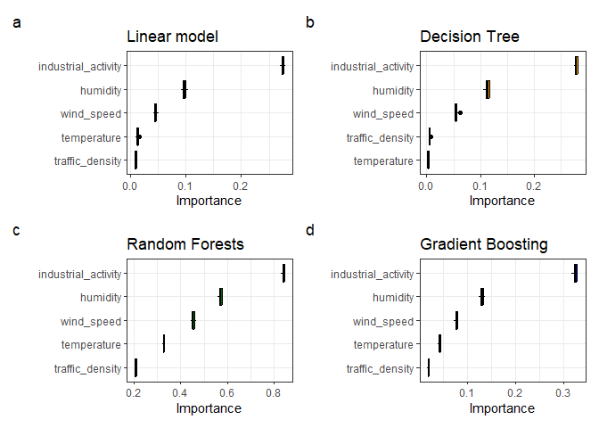<!-- -->

### 5.1 Variable associations

Another popular model intepretation method is the partial dependence
plot. It gives information about a how a predictor variable and the
predicted response variable are linked to each other.

``` r
# Combine partial dependence data for the industrial_activity predictor across all models
pdp1   <- rbind(
  model.lm %>%  partial(pred.var=c("industrial_activity")) %>% cbind(., algorithm = "Linear model"),         # PDP from linear model
  model.cart %>%  partial(pred.var=c("industrial_activity"), approx=F) %>% cbind(., algorithm = "Decision Tree"), # PDP from decision tree (exact values)
  model.rf %>%  partial(pred.var=c("industrial_activity"), approx=F) %>% cbind(., algorithm = "Random Forests"),  # PDP from random forest
  model.gbm %>%  partial(pred.var=c("industrial_activity"), approx=F)  %>% cbind(., algorithm = "Gradient Boosting") # PDP from gradient boosting
) 

# set factor levels so the order of algorithms is consistent in plots
pdp1$algorithm <- factor(pdp1$algorithm, levels=c("Linear model","Decision Tree","Random Forests","Gradient Boosting"))

# Combine partial dependence data for the humidity predictor across all models
pdp2   <- rbind(
  model.lm %>%  partial(pred.var=c("humidity")) %>% cbind(., algorithm = "Linear model"),
  model.cart %>%  partial(pred.var=c("humidity"), approx=F) %>% cbind(., algorithm = "Decision Tree"),
  model.rf %>%  partial(pred.var=c("humidity"), approx=F) %>% cbind(., algorithm = "Random Forests"),
  model.gbm %>%  partial(pred.var=c("humidity"), approx=F)  %>% cbind(., algorithm = "Gradient Boosting")
) 
pdp2$algorithm <- factor(pdp2$algorithm, levels=c("Linear model","Decision Tree","Random Forests","Gradient Boosting"))
```

``` r
Fig05a <-
ggplot(pdp1, aes(x = `industrial_activity`, y = yhat, color = algorithm)) +
  geom_line(size = 1) +                                                                # draw one line per model
  scale_color_manual(values = c("Linear model"   = "darkgrey",
                                "Decision Tree"  = "orange",
                                "Random Forests" = "darkgreen",
                                "Gradient Boosting" = "darkblue"))  +
  ylab("Partial dependence") +
  theme_bw() +
  theme(legend.position = c(0.7, 0.2))
Fig05a  # plot PDP curves for industrial_activity across models
```

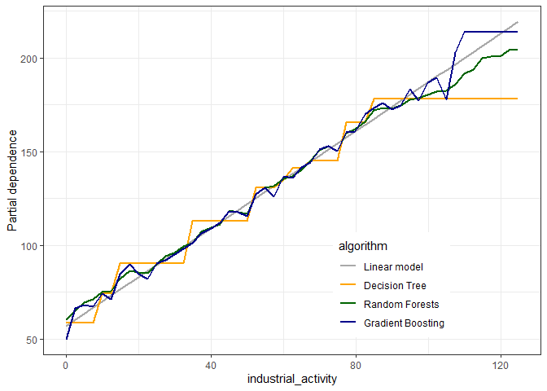<!-- -->

``` r
Fig05b <-
ggplot(pdp2, aes(x = `humidity`, y = yhat, color = algorithm)) +
  geom_line(size = 1) +                                                                 # draw one line per model
  scale_color_manual(values = c("Linear model"   = "darkgrey",
                                "Decision Tree"  = "orange",
                                "Random Forests" = "darkgreen",
                                "Gradient Boosting" = "darkblue"))  +
  ylab("Partial dependence") +
  theme_bw() +
  theme(legend.position = c(0.8, 0.2))

Fig05b  # plot PDP curves for humidity across models
```

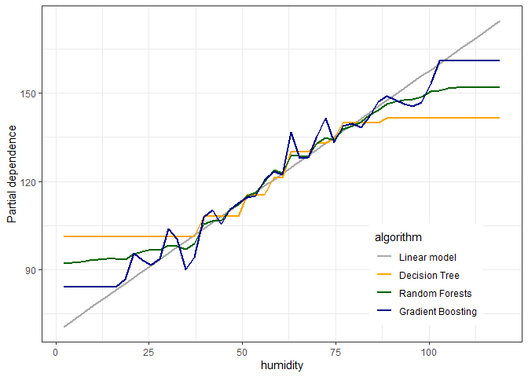<!-- -->

PDPs allow detecting relationships between predictors and response
variables. Indeed, in the environmental and earth system sciences,
partial dependence plots are a popular choice. However, when dealing
with highly correlated variables, Accumulated local effect (ALE) plots
are considered more reliable than PDP, as PDP assumes independence of
variables which often cannot be guaranteed in environmental sciences.

Here is an example to draw an ALE plot.

``` r
# Define a generic prediction function for caret models
pred.fun <- function(model, newdata) predict(model, newdata)

# For the random forest
predictor_gbm <- Predictor$new(
  model       = model.gbm,
  data        = data_train[ , -which(names(data_train) == "AQI")],
  y           = data_train$AQI,
  predict.fun = pred.fun
)

ale_gbm_humidity <- FeatureEffect$new(
  predictor = predictor_gbm,
  feature   = "humidity",
  method    = "ale"
)
plot(ale_gbm_humidity)
```

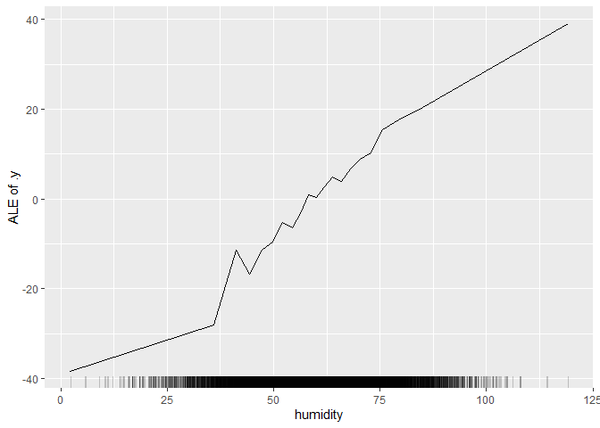<!-- -->

### 5.3 Variable interactions

Domain knowledge about air quality may suggests a few plausible
interactions:

- **Industrial activity × Humidity:** High humidity can trap particulate
  matter and slow dispersion, so the effect of industrial emissions may
  depend on ambient moisture.

- **Industrial activity × Wind speed:** Increased wind can disperse
  pollutants, so emissions might be less impactful when winds are
  strong.

- **Humidity × Temperature:** Temperature and humidity together
  influence chemical reactions that create secondary pollutants like
  ozone.

We can use 2-Way interaction PDPs to detect variable interaction
effects. For this exploration, we select gradient boosting model,
because it ranked high in the performance metric and allows to detect
non-linear interaction effects.

``` r
pdp2w1 <- model.gbm %>%  partial(pred.var=c("industrial_activity", "humidity"), approx=T, n.trees=500) %>% autoplot + labs(title="Gradient Boosting")
pdp2w1
```

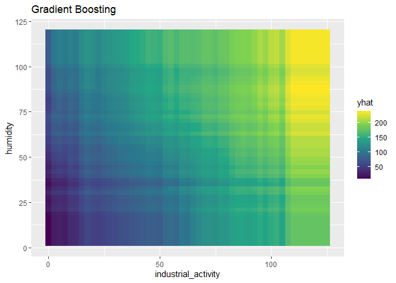<!-- -->

``` r
pdp2w2 <- model.gbm %>%  partial(pred.var=c("wind_speed", "humidity"), approx=T, n.trees=500) %>% autoplot + labs(title="Gradient Boosting")
pdp2w2
```

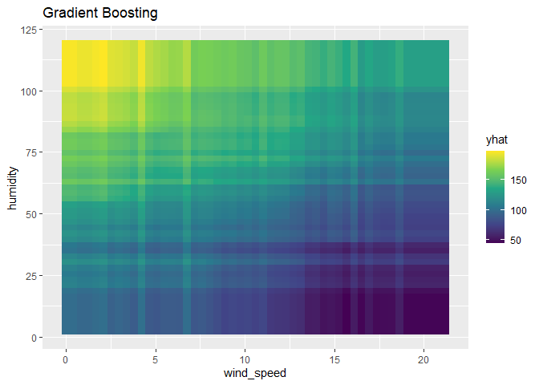<!-- -->

``` r
pdp2w3 <- model.gbm %>%  partial(pred.var=c("temperature", "humidity"), approx=T, n.trees=500) %>% autoplot + labs(title="Gradient Boosting")
pdp2w3
```

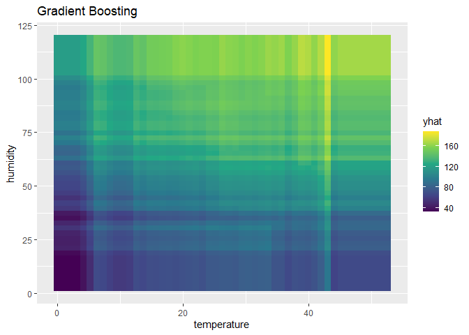<!-- -->

Alternatively, we can draw a 3D PDP.

``` r
# Compute a 3‑D PDP for industrial_activity × humidity
pdp_gbm_interact <- partial(
  object      = model.gbm,
  pred.var    = c("industrial_activity", "humidity"),
  n.trees     = model.gbm$bestTune$n.trees,  # use the best number of trees found during training
  chull       = TRUE,                        # restrict grid to the data's convex hull
  approx      = TRUE,                        # set to TRUE for faster approximations on large data
  grid.resolution = 25                       # Less grids per dimension
)

# Plot as a wireframe surface
plotPartial(
  pdp_gbm_interact,
  levelplot = FALSE,          # FALSE gives a wireframe surface instead of a contour heatmap
  drape     = TRUE,           # add a colour gradient over the surface
  zlab      = "Predicted AQI"
)
```

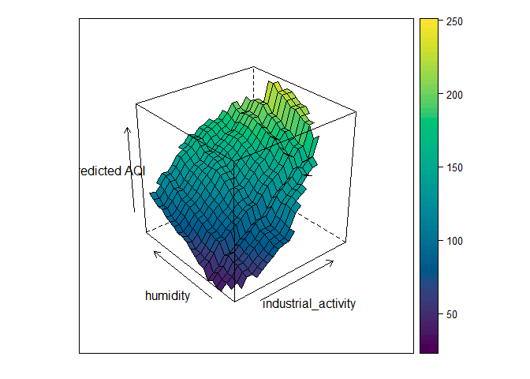<!-- -->

## 6 Further literature on learning machine learning

**Textbooks**  
- James, G., Witten, D., Hastie, T., Tibshirani, R., & Taylor, J.
(2023). *An Introduction to Statistical Learning: with Applications in
R* Cham: Springer International Publishing.
<https://www.statlearning.com/> - Molnar, C. (2020). *Interpretable
Machine Learning.* Lulu.com.
<https://christophm.github.io/interpretable-ml-book/>

**Case study example**  
- Ryo, M. (2022). Explainable artificial intelligence and interpretable
machine learning for agricultural data analysis. *Artificial
Intelligence in Agriculture, 6*, 257–265. (**Basis for the tutorial
code**)

**Review (Earth & environmental sciences)**  
- Schiller, J., Stiller, S., & Ryo, M. (2025). Artificial intelligence
in environmental and Earth system sciences: explainability and
trustworthiness. *Artificial Intelligence Review, 58(10)*, 1–23.
